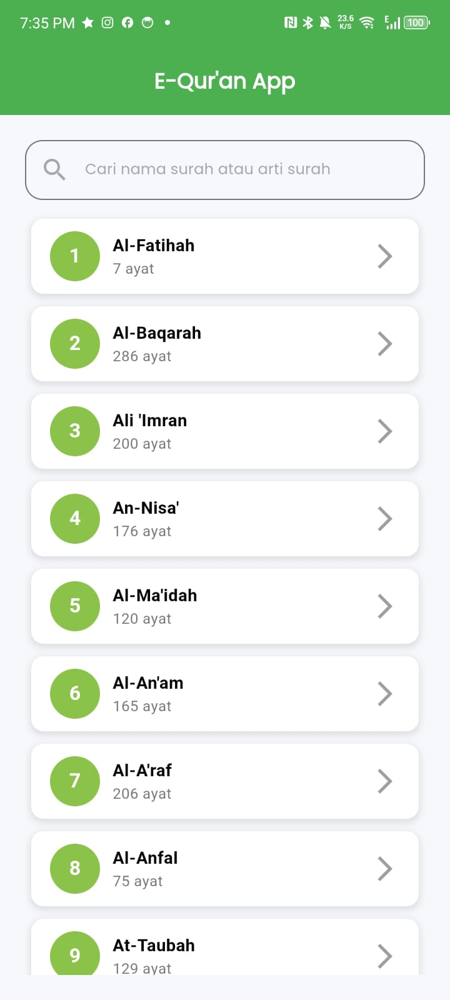
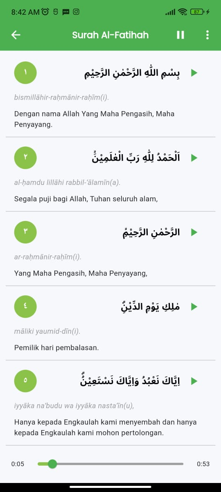
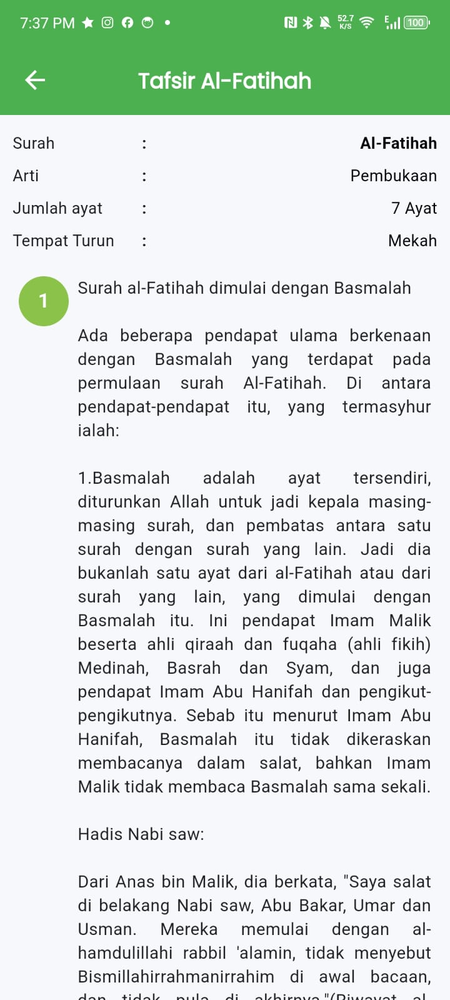
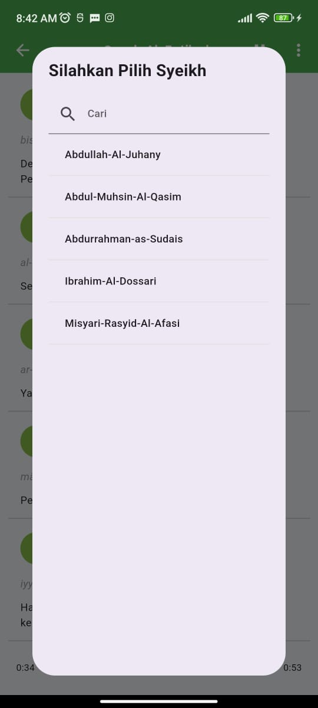
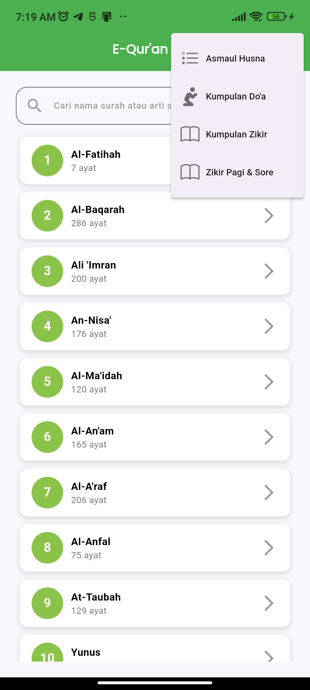

# 📖 E-Qur'an App

A modern Flutter application for accessing and studying the Qur'an with useful Islamic features.

---

## ✨ Features

- 📚 List of Surahs with details
- 🧾 Read Ayahs of each Surah
- 📖 View Tafsir (interpretation) for each Surah
- 🎙 Select and listen to recitations from different Sheikhs
- 🕌 Access **Asmaul Husna**, **Dhikir**, and **Du'a**

---

## 📸 Screenshots

### 🏠 Home Layout - List of Surahs

### 📜 Ayah Layout - List of Verses

### 📖 Tafsir Layout - Interpretations

### 🎧 Sheikh Selection

### 🌟 New Features: Asmaul Husna, Dhikir, Du'a

---

## 🚀 Getting Started

This project is a starting point for a Flutter application. To get started:

1. Install Flutter from [flutter.dev](https://flutter.dev)
2. Clone this repository
3. Run `flutter pub get`
4. Launch using `flutter run`

---

## 📡 Powered By Public APIs

- 📘 [equran.id API](https://equran.id/apidev/v2)
- 🌙 [Muslim API](https://muslim-api-three.vercel.app/)

---

## 📚 Resources

- [Write your first Flutter app](https://docs.flutter.dev/get-started/codelab)
- [Flutter Cookbook](https://docs.flutter.dev/cookbook)
- [Flutter Documentation](https://docs.flutter.dev/)

---

> Thank you for using E-Qur'an App. May it benefit your spiritual journey. 🌙